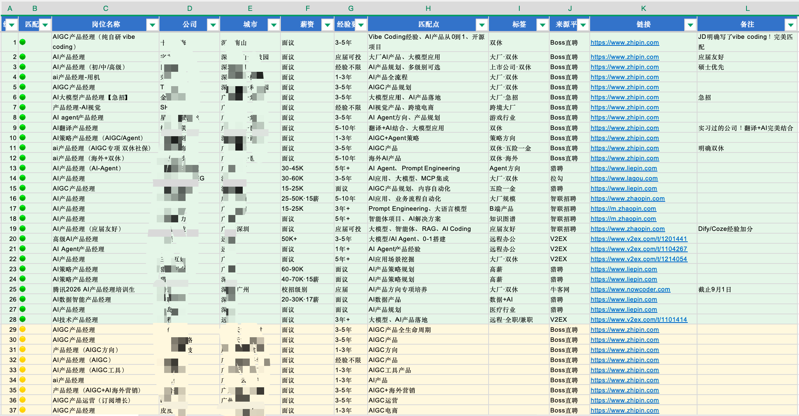
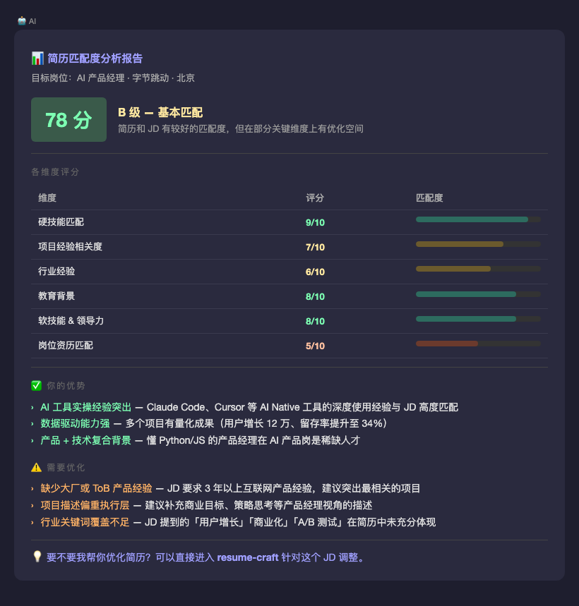
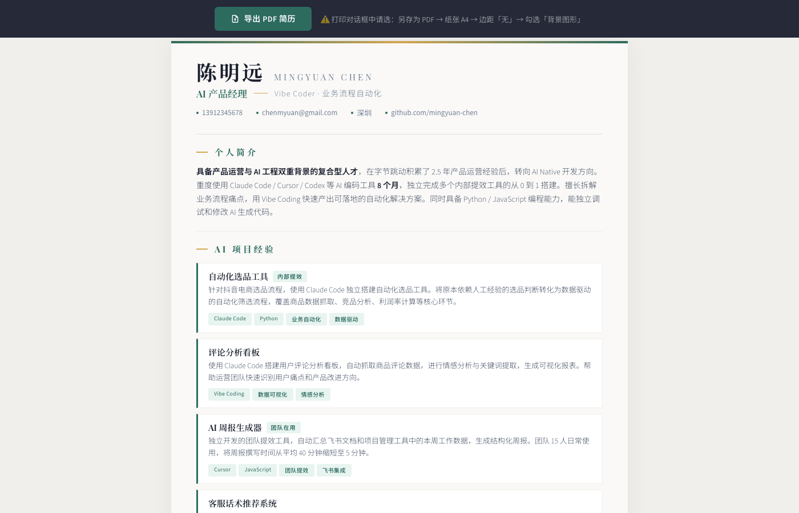
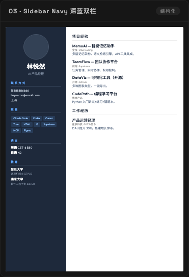
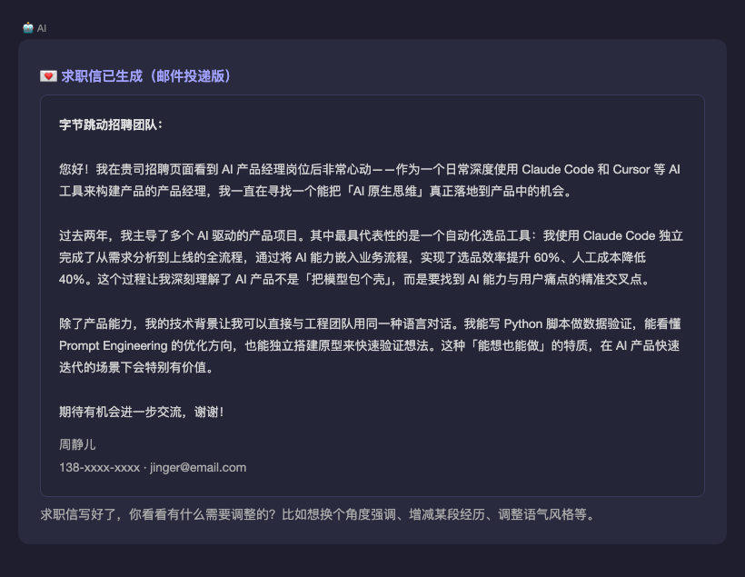
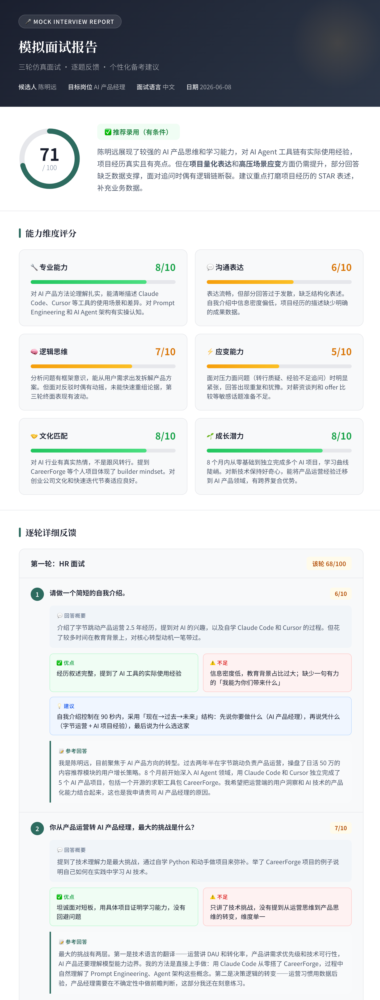
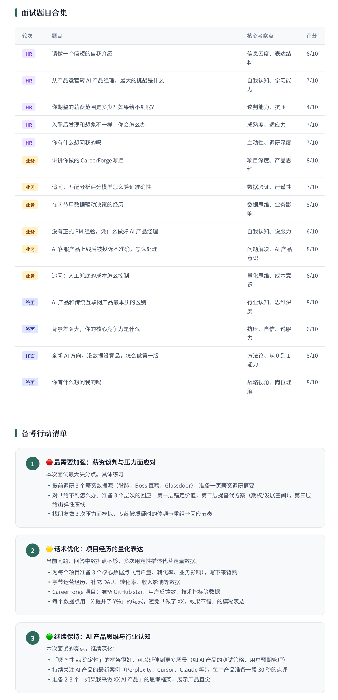
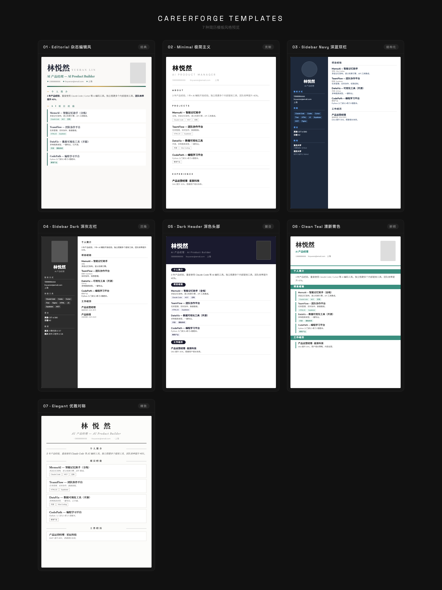

# CareerForge — 接offer神器


**AI 驱动的求职全链路工具包**，基于 AI Agent Skills 构建。从岗位搜索到简历优化再到模拟面试，让 AI 帮你拿到心仪的 offer。

兼容所有支持 Skills 的 AI Agent（Claude Code、Codex 等）。

---

## 包含 5 个 Skill

| Skill | 功能 | 触发方式 |
|-------|------|----------|
| **job-hunt** | AI 岗位猎手，自动搜索 12+ 平台匹配岗位，支持 Boss 直聘浏览器联动，输出 Excel | `/job-hunt` 或 "帮我找工作" |
| **resume-match** | 简历 × JD 智能匹配分析，输出匹配度评分与优化建议 | `/resume-match` 或 "帮我分析简历匹配度" |
| **resume-craft** | 多模板简历生成与优化，7 种专业排版，输出 HTML + PDF | `/resume-craft` 或 "帮我做一份简历" |
| **cover-letter** | 求职信 & 招聘软件打招呼消息生成 | `/cover-letter` 或 "帮我写求职信" |
| **mock-interview** | 三轮 AI 模拟面试 + 逐题反馈报告 | `/mock-interview` 或 "帮我模拟面试" |

> 💡 每个 Skill 独立可用，也可串联使用：搜岗位 → 分析匹配度 → 优化简历 → 写求职信 → 模拟面试

---

## 安装

### 方式一：一键安装全部 Skill（推荐）

在你的项目目录下运行：

```bash
curl -sL https://raw.githubusercontent.com/rebecha1227-a11y/CareerForge/main/install.sh | bash
```

这会自动下载并安装所有 5 个 Skill 到 `./skills/` 目录。

### 方式二：克隆仓库

```bash
git clone https://github.com/rebecha1227-a11y/CareerForge.git
cd CareerForge
./install.sh
```

### 方式三：让 AI Agent 帮你装

直接把仓库链接发给你的 AI Agent：

> "帮我安装这个 Skill 包：https://github.com/rebecha1227-a11y/CareerForge"

### 安装后的文件结构

```
your-project/
└── skills/
    ├── job-hunt/            # Skill 1：岗位搜索
    │   └── SKILL.md
    ├── resume-match/        # Skill 2：匹配分析
    │   ├── SKILL.md
    │   └── references/
    ├── resume-craft/        # Skill 3：简历生成
    │   ├── SKILL.md
    │   ├── templates/       # 7 种 HTML 模板
    │   ├── scripts/         # PDF 生成 & 照片处理
    │   └── references/      # 设计规范
    ├── cover-letter/        # Skill 4：求职信
    │   └── SKILL.md
    └── mock-interview/      # Skill 5：模拟面试
        └── SKILL.md
```

### 可选依赖

| 依赖 | 用途 | 安装命令 |
|------|------|----------|
| Playwright | 后台生成 PDF（不装也能用浏览器导出） | `pip install playwright && playwright install chromium` |
| Pillow | 简历照片裁剪压缩 | `pip install Pillow` |
| openpyxl | 岗位搜索结果导出 Excel | `pip install openpyxl` |

---

## 使用流程

安装完成后，打开 Claude Code（或其他支持 Skills 的 AI Agent），用自然语言或斜杠命令触发对应 Skill。

### 🔍 Skill 1：岗位搜索（job-hunt）

```
你：/job-hunt（或"帮我找工作"、"搜一下合适的岗位"）
AI：请提供你的简历，或者告诉我你的职业方向
你：[上传简历]
AI：→ 从简历提取方向，确认搜索条件（城市、硬性要求等）
   → 自动展开 10-20 组搜索关键词
   → 并行搜索 12+ 个平台（Boss直聘、猎聘、智联、拉勾、LinkedIn、V2EX...）
   → 如果有 Chrome MCP 插件，还能直接搜 Boss 直聘已保存的岗位分组
   → 输出 50-200+ 个匹配岗位（🟢高度匹配 / 🟡基本匹配 / 🟠可以尝试）
   → 可导出 Excel 表格，带颜色标注和筛选器
   → 对感兴趣的岗位，一键跳转到匹配分析或写求职信
```

**输出效果：**



### 📊 Skill 2：简历匹配分析（resume-match）

```
你：/resume-match（或"帮我分析一下简历和 JD 的匹配度"）
AI：请提供你的简历和目标岗位 JD
你：[上传简历 + 粘贴 JD]
AI：→ 输出多维度匹配评分（硬技能、软技能、经验、教育等）
   → 匹配等级（S/A/B/C/D）
   → 逐项优化建议
   → 如果匹配度不够，可以一键跳转到 resume-craft 优化简历
```

**输出效果：**



### 📝 Skill 3：简历生成（resume-craft）

```
你：/resume-craft（或"帮我做一份简历"）
AI：你是想从零做一份新简历，还是优化已有简历？
你：从零做
AI：[通过对话收集你的经历、技能、教育等信息]
AI：推荐 3 种适合你的模板风格，你选哪个？
你：第一个
AI：→ 生成完整的 HTML 简历
   → 自动生成 PDF 文件
   → 内置导出按钮，也可以在浏览器中手动导出
```

**生成的简历效果：**

| Editorial 杂志编辑风 | Sidebar Navy 深蓝双栏 |
|:---:|:---:|
|  |  |

### 💌 Skill 4：求职信（cover-letter）

```
你：/cover-letter（或"帮我写一封求职信"）
AI：你是要写邮件投递的正式求职信，还是招聘软件上的打招呼消息？
你：邮件投递
AI：→ 基于你的简历和 JD，生成 300-500 字的求职信
   → 不是简历复述，而是讲故事、建立连接
   → 可以多轮修改，直到你满意
   → 支持中英文双语（不是翻译，是分别按各自文化习惯撰写）
```

**输出效果：**



### 🎤 Skill 5：模拟面试（mock-interview）

```
你：/mock-interview（或"帮我模拟面试"）
AI：请提供目标岗位 JD 和你的简历
你：[提供材料]
AI：面试马上开始，一共三轮——

第一轮：HR 面试（5-6 题）
  → 考察求职动机、文化匹配、稳定性
  → 表面友好，但会在关键问题上追问

第二轮：业务主管面试（6-8 题）
  → 深挖项目经历（追问 2-3 层）
  → 情景题、压力面

第三轮：高管终面（4-5 题）
  → 开放性问题，看思维方式
  → 会提出反面论点要求回应

面试结束后 →
  → 综合评分 + 录用建议
  → 6 维度能力雷达图
  → 逐题详细反馈 + 个性化参考回答
  → 备考行动清单
```

**输出效果：**

| 总评 & 能力维度 | 逐题反馈 & 备考建议 |
|:---:|:---:|
|  |  |

---

## 7 种简历模板



| 编号 | 模板 | 风格 | 适合 |
|:---:|------|------|------|
| 01 | Editorial 杂志编辑风 | 经典文艺，奶油色底 | 创意 / 文化 / 教育 |
| 02 | Minimal 极简主义 | 纯白底，极少装饰 | 科技 / 设计 / 外企 |
| 03 | Sidebar Navy 深蓝双栏 | 左侧深蓝栏，信息密度高 | 技术 / 产品 |
| 04 | Sidebar Dark 深灰左栏 | 沉稳大气 | 管理 / 金融 / 咨询 |
| 05 | Dark Header 深色头部 | 顶部深色块，对比醒目 | 互联网 / 创业公司 |
| 06 | Clean Teal 清新青色 | 白底 + 青绿色条 | 万能模板 |
| 07 | Elegant 优雅对称 | 居中对称，衬线体 | 学术 / 高管 / 传统行业 |

所有模板支持自定义配色 —— 告诉 AI 你喜欢的颜色就行。

---

## 完整求职流程示例

```
第 1 步：搜岗位
  你："帮我找工作" 或 /job-hunt
  AI → 分析简历，展开 10-20 组关键词，搜 12+ 个平台
     → 输出 100+ 匹配岗位，导出 Excel
       ↓ 挑到感兴趣的岗位

第 2 步：分析匹配度
  你："帮我分析简历和这个 JD 的匹配度"
  AI → 评分 72 分（B 级），硬技能匹配但项目经验不够突出
       ↓ 建议优化简历

第 3 步：优化简历
  你："那帮我优化一下简历"
  AI → 自动衔接上一步的分析结果
     → 针对 JD 重写项目经历描述，突出匹配的关键词
     → 生成 HTML + PDF
       ↓ 简历搞定，准备投递

第 4 步：写求职信
  你："帮我写一封邮件求职信"
  AI → 基于优化后的简历 + JD，生成个性化求职信
     → 不是简历复述，突出独特价值
       ↓ 投递材料齐了，准备面试

第 5 步：模拟面试
  你："帮我模拟面试"
  AI → 三轮仿真面试（HR → 业务 → 高管）
     → 面试报告 + 逐题反馈 + 备考建议
       ↓ 上战场！
```

---

## License

MIT

---

> 用 AI 写代码做出来的 AI 求职工具，这就是 Vibe Coding ✨
